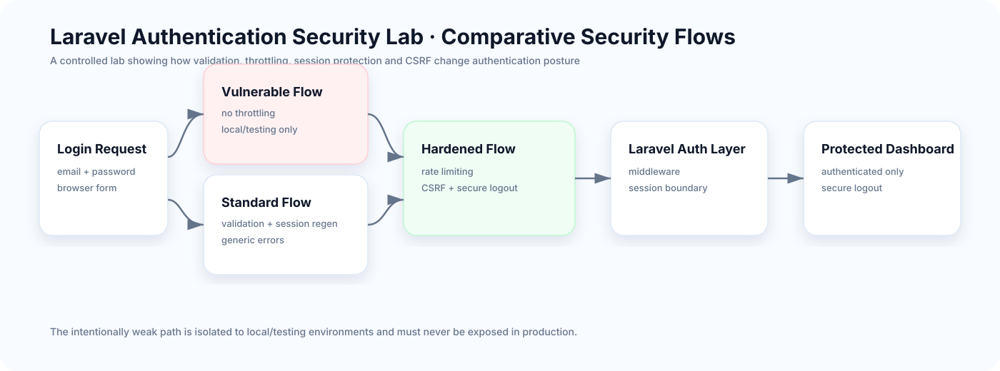

<div align="center">

# Laravel Authentication Security Lab

### Compare vulnerable, standard & hardened authentication flows

**Validation · generic errors · throttling · session regeneration · CSRF · protected routes · secure logout**

[](https://github.com/chaima-menouar/laravel-auth-security-lab/actions/workflows/tests.yml)


</div>

An educational Laravel application that demonstrates how small authentication decisions materially change security posture. Three login paths are kept separate so the differences are visible and testable.

## Architecture



The intentionally weak flow is restricted to local/testing environments. Standard and hardened paths use Laravel's normal authenticated application boundary.

## Security comparison

| Authentication flow | Validation | Generic errors | Rate limiting | Session regeneration | Availability |
|---|---:|---:|---:|---:|---|
| Vulnerable | No | No | No | No | Local/testing only |
| Standard | Yes | Yes | No | Yes | All environments |
| Secure | Yes | Yes | 3 attempts / 5 min | Yes | All environments |

## Controls demonstrated

- server-side input validation;
- generic authentication-failure messages;
- login-attempt rate limiting;
- session ID regeneration after authentication;
- CSRF protection on forms;
- authentication middleware for protected routes;
- session invalidation and CSRF-token regeneration on logout;
- environment-based isolation of intentionally vulnerable behavior.

## Technology stack

`PHP 8.2+` · `Laravel 12` · `SQLite` · `Blade` · `Bootstrap 5` · `Tailwind CSS 4` · `Vite 6` · `PHPUnit 11` · `GitHub Actions`

## Routes

| Route | Purpose | Access |
|---|---|---|
| `/` | Security lab overview | Public |
| `/auth/vulnerable` | Intentionally weak demo | Local/testing only |
| `/auth/standard` | Standard login | Guests |
| `/auth/secure` | Hardened login | Guests |
| `/dashboard` | Protected workspace | Authenticated users |

## Local installation

```bash
git clone https://github.com/chaima-menouar/laravel-auth-security-lab.git
cd laravel-auth-security-lab
composer install
npm install
cp .env.example .env
php artisan key:generate
php -r "file_exists('database/database.sqlite') || touch('database/database.sqlite');"
php artisan migrate --seed
npm run build
php artisan serve
```

Open `http://127.0.0.1:8000`.

### Demo account

```text
Email: test@example.com
Password: password
```

Local demonstration only.

## Testing

```bash
php artisan test
```

Feature tests cover routing, guest protection, successful authentication, invalid credentials, throttling and secure logout. GitHub Actions installs dependencies, builds assets and runs the test suite.

## Security notice

This repository intentionally contains an insecure authentication example for learning purposes. That route must never be exposed as a production login path.

## Author

**Chaima Menouar** · AI & Digital Transformation Engineering Student
