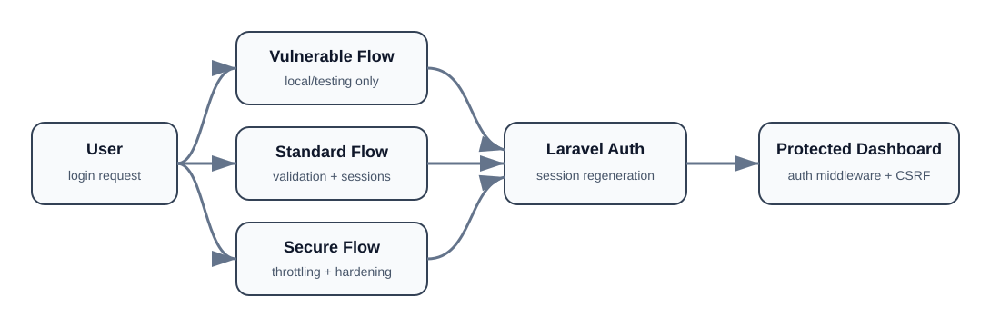

# Laravel Authentication Security Lab

[](https://github.com/chaima-menouar/laravel-auth-security-lab/actions/workflows/tests.yml)

An educational Laravel application that compares vulnerable, standard, and hardened authentication flows. It demonstrates how validation, generic error messages, login throttling, session regeneration, protected routes, and secure logout change the security posture of a login system.

## Architecture



The three flows are intentionally separated for comparison. The vulnerable variant is restricted to local/testing environments, while the standard and secure flows use Laravel's normal application boundary and authenticated dashboard.

## Project objective

| Authentication flow | Input validation | Generic errors | Rate limiting | Session regeneration | Availability |
|---|---:|---:|---:|---:|---|
| Vulnerable | No | No | No | No | Local/testing only |
| Standard | Yes | Yes | No | Yes | All environments |
| Secure | Yes | Yes | 3 attempts / 5 min | Yes | All environments |

## Security controls demonstrated

- server-side input validation;
- generic authentication failure messages;
- login attempt rate limiting;
- session ID regeneration after authentication;
- CSRF protection on forms;
- authentication middleware for protected routes;
- session invalidation and CSRF-token regeneration on logout;
- environment-based isolation of the intentionally vulnerable demonstration.

## Technology stack

- PHP 8.2+
- Laravel 12
- SQLite
- Blade
- Bootstrap 5
- Tailwind CSS 4
- Vite 6
- PHPUnit 11
- GitHub Actions

## Application routes

| Route | Purpose | Access |
|---|---|---|
| `/` | Security lab overview | Public |
| `/auth/vulnerable` | Intentionally weak authentication demo | Local/testing only |
| `/auth/standard` | Standard authentication flow | Guests |
| `/auth/secure` | Hardened authentication flow | Guests |
| `/dashboard` | Protected dashboard | Authenticated users |

## Local installation

```bash
git clone https://github.com/chaima-menouar/laravel-auth-security-lab.git
cd laravel-auth-security-lab
composer install
npm install
cp .env.example .env
php artisan key:generate
php -r "file_exists('database/database.sqlite') || touch('database/database.sqlite');"
php artisan migrate --seed
npm run build
php artisan serve
```

Open `http://127.0.0.1:8000`.

## Local demo account

```text
Email: test@example.com
Password: password
```

These credentials are for local demonstration only.

## Testing

```bash
php artisan test
```

The feature tests cover public routing, guest protection, successful authentication, invalid credentials, throttling, and secure logout behavior. GitHub Actions installs dependencies, builds frontend assets, and runs the test suite on pushes and pull requests.

## Project structure

```text
app/Http/Controllers/LoginFaille/
    StandardLoginController.php
    SecureLoginController.php
    VulnerableLoginController.php

resources/views/login-faille/
    standard.blade.php
    secure.blade.php
    vulnerable.blade.php

routes/web.php
tests/Feature/AuthenticationSecurityTest.php
.github/workflows/tests.yml
```

## Security notice

This is an educational security lab. The vulnerable flow intentionally omits important protections and must never be exposed as a production login path.

## Author

**Chaima Menouar**  
AI & Digital Transformation Engineering Student
